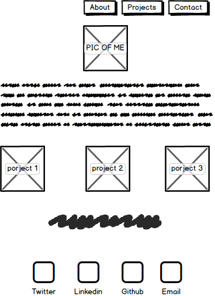

_will be updated through out the build process_

# My Portfolio Website Design 

Learn HTML, CSS and JavaScript through the hands on design and development of my portfolio webpage.

***

##To Do List
1. Develop and understand HTML
2. Develop and understand CSS
3. Build out the basic layout of the site.
4. Contact Links
   * LinkedIn
   * Twitter
   * Email
5. Build out the CSS file to show understanding of CSS.

***

### Website Mockup

